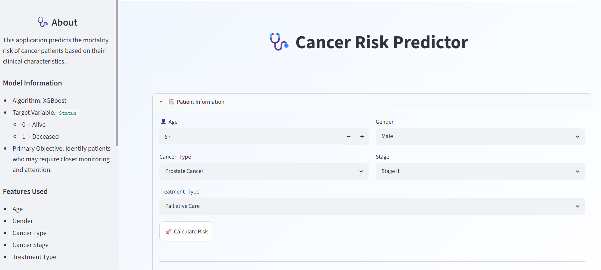
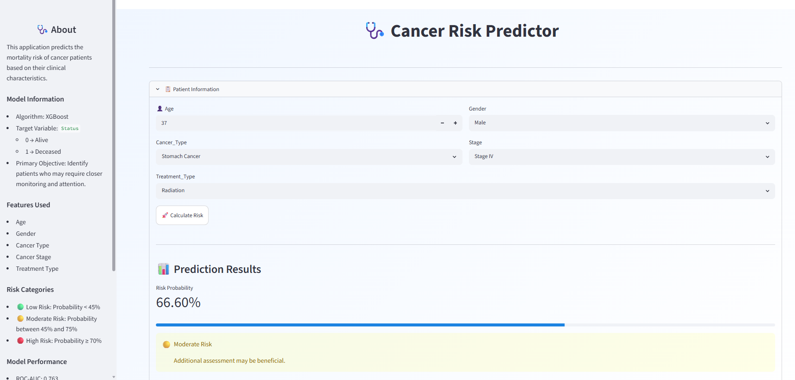

# 🩺 Cancer Risk Prediction

## 📌 Overview

This project uses Machine Learning to predict the mortality risk of cancer patients based on their clinical information.

The main goal of this project is to identify patients who may be at higher risk and require closer monitoring. Instead of focusing only on accuracy, special attention was given to reducing the number of high-risk patients missed by the model.

The final model was deployed as an interactive Streamlit web application.

---


------
## 🚀 Features

* Predicts mortality risk using Machine Learning
* Interactive Streamlit dashboard
* Displays prediction probability
* Categorizes patients into:

  * 🟢 Low Risk
  * 🟡 Moderate Risk
  * 🔴 High Risk
* Uses XGBoost as the final model
* Includes threshold tuning for better risk identification

---
## 📊 Dataset

The dataset used in this project was obtained from Kaggle.

Source: Cancer Patients Prediction Dataset

Kaggle Link: https://www.kaggle.com/datasets/ashyou09/india-cancer-patient-dataset-2022-2025/data

The dataset contains patient demographic and clinical information, including age, gender, cancer type, stage, treatment type, and survival status. These features were used to build and evaluate machine learning models for risk prediction.

---

## 📊 Dataset Features

The model uses the following patient information:

* Age
* Gender
* Cancer Type
* Cancer Stage
* Treatment Type

---

## 🔄 Project Workflow

1. Data Cleaning
2. Exploratory Data Analysis (EDA)
3. Feature Engineering
4. Data Preprocessing
5. Model Training
6. Model Comparison
7. Hyperparameter Tuning
8. Threshold Optimization
9. Streamlit Deployment

---

## 🤖 Models Evaluated

The following models were tested:

* Logistic Regression
* Random Forest
* XGBoost
* LightGBM

After comparing performance, XGBoost was selected as the final model.

---

## 📈 Model Performance

| Metric   | Score |
| -------- | ----- |
| ROC-AUC  | 0.763 |
| F1 Score | 0.798 |
| Recall   | 95.2% |

A custom threshold of **0.45** was used to improve recall and reduce the number of high-risk patients missed by the model.

---

## 💡 Key Finding

One interesting result from this project was that Logistic Regression performed very close to XGBoost.

Although XGBoost achieved the best overall performance, the difference was relatively small, showing that more complex models do not always provide significantly better results.

The final model was chosen based on the project's objective of identifying as many high-risk patients as possible.

---

## 🖥️ Streamlit Application

The application allows users to:

* Enter patient information
* Predict mortality risk
* View probability scores
* View risk categories
* Receive an easy-to-understand prediction result

---


## 🛠️ Technologies Used

* Python
* Pandas
* NumPy
* Matplotlib
* Seaborn
* Scikit-learn
* XGBoost
* LightGBM
* Streamlit
* Joblib

---

## 📂 Project Structure

```text
ml_project_cancer_risk_prediction/
│
├── artifacts/
│   ├── xgb_cancer_risk_model.pkl
│   └── feature_names.pkl
│
├── notebooks/
│   └── cancer prediction.ipynb
│
├── main.py
├── prediction_helper.py
├── requirements.txt
├── README.md
├── images/
    └── overview.png
    └── prediction.png
```

---

## ⚙️ Installation

Clone the repository:

```bash
git clone https://github.com/jeema90/ml_project_cancer_risk_prediction.git
```

Move into the project folder:

```bash
cd ml_project_cancer_risk_prediction
```

Install dependencies:

```bash
pip install -r requirements.txt
```

Run the Streamlit application:

```bash
streamlit run main.py
```

---

## 🎯 What I Learned

Through this project, I learned:

* How to perform EDA on healthcare data
* How to compare multiple classification models
* How to tune hyperparameters
* How to interpret Precision, Recall, F1 Score, and ROC-AUC
* How threshold tuning affects model behavior
* How to deploy Machine Learning models using Streamlit

---

## ⚠️ Disclaimer

This project was created for educational and portfolio purposes only.

The predictions generated by this model should not be considered medical advice and must not be used as a substitute for professional healthcare decisions.

---